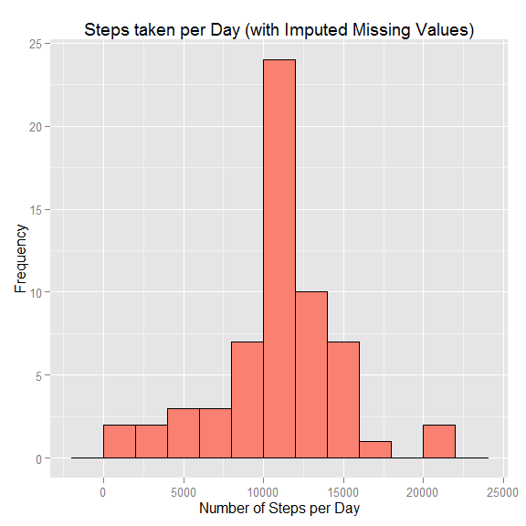

# Reproducible Research: Peer Assessment 1

This assignment makes a brief analysis of data collected from a personal activity monitoring device. This device collects data at 5 minute intervals through out the day. The data consists of two months of data from an anonymous individual collected during the months of October and November, 2012 and include the number of steps taken in 5 minute intervals each day.  

## Loading and preprocessing the data

The Activity Monitoring Data set was provided in a comma-separated-value (CSV) file within a zip archive.  The variables included in this dataset are:  
  
- steps: Number of steps taking in a 5-minute interval (missing values are coded as NA)  
- date: The date on which the measurement was taken in YYYY-MM-DD format  
- interval: Identifier for the 5-minute interval in which measurement was taken.  
  
- There are 12 observations per hour, 288 observations per day.  
  
The CSV file was extracted from its archive and read into a data frame with its headers.  


```r
act <- read.csv("activity.csv", header = TRUE)
## Preliminary Data Exploration
dim(act)
```

```
## [1] 17568     3
```

```r
head(act, 3)
```

```
##   steps       date interval
## 1    NA 2012-10-01        0
## 2    NA 2012-10-01        5
## 3    NA 2012-10-01       10
```

```r
summary(act$steps)
```

```
##    Min. 1st Qu.  Median    Mean 3rd Qu.    Max.    NA's 
##    0.00    0.00    0.00   37.38   12.00  806.00    2304
```

```r
mean(is.na(act[, 1]))
```

```
## [1] 0.1311475
```
Out of 17568 observations in the data set, there are 2304 missing values.  Because their proportion is relativley low (13.11%), we choose to ignore the missing values for now.  
  

```r
head(act[10:15,])
```

```
##    steps       date interval
## 10    NA 2012-10-01       45
## 11    NA 2012-10-01       50
## 12    NA 2012-10-01       55
## 13    NA 2012-10-01      100
## 14    NA 2012-10-01      105
## 15    NA 2012-10-01      110
```

```r
head(act[22:27,])
```

```
##    steps       date interval
## 22    NA 2012-10-01      145
## 23    NA 2012-10-01      150
## 24    NA 2012-10-01      155
## 25    NA 2012-10-01      200
## 26    NA 2012-10-01      205
## 27    NA 2012-10-01      210
```

A peek at the data at the inter-hour boundaries shows a gap in the interval identifier between n55 and (n+1)00, where n is the hour of observation.  
  
## What is mean total number of steps taken per day?

The data set is grouped and summed by date in order to plot a histogram of the total number of steps taken each day.  


```r
library(dplyr)
```

```
## 
## Attaching package: 'dplyr'
## 
## The following object is masked from 'package:stats':
## 
##     filter
## 
## The following objects are masked from 'package:base':
## 
##     intersect, setdiff, setequal, union
```

```r
library(ggplot2)

dsteps <- act %>% 
          group_by(date) %>% 
          summarise_each(funs(sum), steps)
```

To estimate the optimal bin width for the histogram we use the [Freedman-Diaconis rule](http://en.wikipedia.org/wiki/Freedman-Diaconis_rule): Bin size = 2*IQR/(n^(1/3), where IQR is the interquartile range of the data and n is the number of observations.  Bin width is rounded to the nearest 500.  


```r
rawBinW <- 500 * round(2 * IQR(dsteps$steps, na.rm = TRUE) / ((dim(dsteps)[1])^(1/3) * 500))
rawBinW
```

```
## [1] 2500
```

```r
rawNBins <- ceiling(diff(range(dsteps$steps, na.rm = TRUE))/rawBinW)  ## Number of bins
rawNBins
```

```
## [1] 9
```

This gives a bin size = 2500 and the number of bins = 9.  However, further in this analysis, missing values are imputed and filled in.  A similar calculation done on the data set with missing data filled in with imputed values yields a bin width = 1500, with the number of bins = 15.

We choose an intermediate value of bin width = 2000, with the number of bins = 11, for both histograms, so as to enable a meaningful comparison between raw and imputed data set characteristics.  


```r
binW <- 2000
nBins <- ceiling(diff(range(dsteps$steps, na.rm = TRUE))/binW)
nBins
```

```
## [1] 11
```

```r
ggplot (dsteps, aes(x = steps)) + 
        geom_histogram(binwidth = binW, fill = "salmon", col = "black") +
        ggtitle("Steps taken per Day (Raw Data)") +
        xlab("Number of Steps per Day") + ylab("Frequency")
```

 


```r
rawMean <- mean(dsteps$steps, na.rm = TRUE)       
rawMean
```

```
## [1] 10766.19
```

```r
rawMed <- median(dsteps$steps, na.rm = TRUE)
rawMed
```

```
## [1] 10765
```

The total number of steps taken per day has a Mean = 10766.19 and a Median = 10765.  
  
  
## What is the average daily activity pattern?

We continue our analysis of the data set by making a time series plot of the average number of steps taken per 5-minute interval averaged across all days.  We also determine the 5-minute interval with the highest number of steps, on average across all days.  Since we cannot include NA values in a time series plot or an average calculation, we omit them in this step.  

The data set is grouped by 5-minute interval and averaged in order to plot the time series.  


```r
iSteps <- act[!is.na(act[,1]),] %>% 
          group_by(interval) %>% 
          summarise_each(funs(mean), steps)
```

As noted earlier, the interval identifier shows gaps between n55 and (n+1)00 at the end of every hour. To get a continuous variable for the time series plot, we add a column with interval expressed as minutes from the start of day.  


```r
iSteps <- mutate(iSteps, minutes = (60*floor(interval/100) + (interval %% 100)))
head(iSteps[10:15,])
```

```
## Source: local data frame [6 x 3]
## 
##   interval     steps minutes
## 1       45 1.4716981      45
## 2       50 0.3018868      50
## 3       55 0.1320755      55
## 4      100 0.3207547      60
## 5      105 0.6792453      65
## 6      110 0.1509434      70
```

```r
tail(iSteps)
```

```
## Source: local data frame [6 x 3]
## 
##   interval     steps minutes
## 1     2330 2.6037736    1410
## 2     2335 4.6981132    1415
## 3     2340 3.3018868    1420
## 4     2345 0.6415094    1425
## 5     2350 0.2264151    1430
## 6     2355 1.0754717    1435
```

The following function is used to format the newly introduced minutes variable into HH:MM for plotting.


```r
timeHM <- function(x) {
    h <- floor(x / 60)
    m <- x %% 60
    HMlabel <- sprintf("%d:%02d", h, m)
    return(HMlabel)
}
```

```r
ggplot (iSteps, aes (x = minutes, y = steps)) + geom_line(col = "salmon", size = 1) + 
        scale_x_continuous(name = "Time", breaks = seq(0, 1440, by = 120), labels = timeHM) +
        ggtitle("Average Daily Activity Pattern") + ylab("Steps per 5-minute Interval")
```

 

```r
iSteps[which.max(iSteps$steps),1]   ## the 5-min interval, on average, across all days with the max # of steps
```

```
## Source: local data frame [1 x 1]
## 
##   interval
## 1      835
```

```r
timeHM(as.integer(iSteps[which.max(iSteps$steps),3]))  ## the HH:MM time of above
```

```
## [1] "8:35"
```
The 5-minute interval with the maximum number of steps on average, across all days, is 835, corresponding to 8:35 a.m.  
  
## Imputing missing values
  
For ease of computation we re-arrange the "steps" variable in an array of values, where each row is the observations in an "interval" and each column is the "date" on which the observation is made.  


```r
library(reshape2)
dcact <- dcast(act, interval ~ date, value.var = "steps")
dim(dcact)
```

```
## [1] 288  62
```

```r
head(dcact[,1:5])
```

```
##   interval 2012-10-01 2012-10-02 2012-10-03 2012-10-04
## 1        0         NA          0          0         47
## 2        5         NA          0          0          0
## 3       10         NA          0          0          0
## 4       15         NA          0          0          0
## 5       20         NA          0          0          0
## 6       25         NA          0          0          0
```

```r
dcrows <- dim(dcact)[1]
dccols <- dim(dcact)[2]
```
dcact is a 288 x 62 data frame (interval x date) where:  
1. Each row is an observation for a given 5-minute interval  
2. Column 1 is the interval identifier  
3. Columns 2 - 62 represent the dates  
4. The entries in the array are the number of steps taken for that interval-date observation.  
  
The missing values are imputed from the mean of that 5-minute interval across all days. Each NA in the row is set to be the mean value of the row (excluding the NA elements in the calculation).  The mean value is rounded off to an integer value, because we cannot have a non-integral number of steps as an observed value (as distinct from a calculated value).  


```r
for (i in 1:dcrows) 
    dcact[i, is.na(dcact[i,])] <- as.integer(round(rowMeans(dcact[i,2:dccols], na.rm = TRUE)))
```

We revert to the original form of the data set for further computation.

```r
##  *** Peer Assessor, please note: Now that I have a 288 x 62 data set of interval x date, there are more elegant 
##  ways of proceeding.  I don't really need to melt. But, the instructions specifically asks us to "Create a new
##  dataset that is equal to the original dataset but with the missing data filled in." ***

newact <- melt(dcact, id.vars = "interval", measure.vars = colnames(dcact)[2:dccols])
colnames(newact)[2:3] <- c("date", "steps") ##  melt() does not revert to the original order and column names.
newact <- newact[c(3,2,1)]                  ##  New data set with missing values filled in
```
The new data set is grouped and summed by date in order to plot a histogram of the total number of steps taken each day.

```r
newdsteps <- newact %>% 
             group_by(date) %>% 
             summarise_each(funs(sum), steps)
newBinW <-  500 * round(2 * IQR(newdsteps$steps, na.rm = TRUE) / ((dim(newdsteps)[1])^(1/3) * 500))
newBinW
```

```
## [1] 1500
```
As explained earlier, although the Freedman-Diaconis rule yields a bin width = 1500, we use a bin width = 2000 as in the earlier histogram, to make a meaningful comparison between raw and imputed data set characteristics.


```r
ggplot (newdsteps, aes(x = steps)) + 
        geom_histogram(binwidth = binW, fill = "salmon", col = "black") +
        ggtitle("Steps taken per Day (with Imputed Missing Values)") +
        xlab("Number of Steps per Day") + ylab("Frequency")
```

 
  
The histogram shows that, except for the modal bin -- the bin with the highest count, which also contains the Mean and Median, i.e. bin [10000-12000) -- this histogram is identical to that made in the first part of the assignment.  This is expected, since the missing values filled in for a 5-minute interval were imputed from the mean of that 5-minute interval across all days.

A closer look reveals that the count in the modal bin has increased from 16 in the original data set to 24 in the new data set.  The increase of 8 in this count is beacuse their are 8 days in the original data set with NAs in every interval observation.  The remaining 53 days have no missing values.  This is demonstrated by the following.


```r
vact <- mutate(act, val = !is.na(act[,1]))      ## element of vact is TRUE (= 1) if not NA in act$steps
nact <- vact %>% 
        group_by(date) %>%                      ## Sum the number of TRUE entries by date
        summarise_each(funs(sum), val)
table(nact$val)                                 ## Show a Table of the number of TRUE entries by date
```

```
## 
##   0 288 
##   8  53
```
From the above, a given date has either all missing values (TRUEs = 0, 8 days in all) or no missing value (TRUEs = 288, 53 days in all).  
  
We calculate the mean and median of the new data set.

```r
newMean <- mean(newdsteps$steps)
newMean
```

```
## [1] 10765.64
```

```r
newMed <- median(newdsteps$steps)
newMed
```

```
## [1] 10762
```
In the new data set the total number of steps taken per day has a Mean = 10765.64 and a Median = 10762.  These are close to those of the old data set, Mean = 10766.19 and Median = 10765.  The difference is due to the rounding off done when filling in imputed values.

Comparing the new summary statistics with the old, we find a reduced inter-quartile range due to data being filled in at mean values, i.e. there more data  points closer to the central point of the distribution.  

```r
summary(newdsteps$steps)
```

```
##    Min. 1st Qu.  Median    Mean 3rd Qu.    Max. 
##      41    9819   10760   10770   12810   21190
```

```r
summary(dsteps$steps)
```

```
##    Min. 1st Qu.  Median    Mean 3rd Qu.    Max.    NA's 
##      41    8841   10760   10770   13290   21190       8
```
  
  
## Are there differences in activity patterns between weekdays and weekends?
  
Using the new data set with filled-in missing values, we add a factor variable "day" to distinguish Weekdays from Weekends. The data set is then grouped by day (weekend or weekday) and 5-minute interval and the average for each interval is calculated.  This data is used to make time series plots, for weekend and weekday, as 2 facets in a single figure.


```r
library(lubridate)
newact$day <- factor(ifelse((wday(as.Date(as.character(newact$date), format = "%Y-%m-%d")) %in% seq(2, 6)),
                                                                     "weekday", "weekend"))
wisteps <- newact %>% 
           group_by(day, interval) %>% 
           summarise_each(funs(mean), steps)

##  Adding a continuous variable expressed as minutes from start of day, to
##  circumvent the end-of-hour discontinuity in the interval variable. 

wisteps <- mutate(wisteps, minutes = (60*floor(interval/100) + (interval %% 100)))
```


```r
ggplot (wisteps, aes (x = minutes, y = steps)) + geom_line(col = "salmon", size = 1) + 
        scale_x_continuous(name = "Time", breaks = seq(0, 1440, by = 120), labels = timeHM) +                  
        facet_wrap( ~ day, ncol = 1, as.table = FALSE) +
        ggtitle("Average Daily Activity Pattern") + 
        ylab("Steps per 5-minute Interval")
```

 
   
There appear to be differences in activity patterns between weekdays and weekends.  
  
#### On Weekdays:

1. There is a burst of activity in the morning, peaking between 8:00 and 9:00 hrs, when the subject takes over 225 steps in some 5-minute intervals.
2. The bulk of the daytime on weekdays shows low activity, with occasional spurts, never reaching 100 steps in a 5-minute interval.  
3. Then between 18:00 and 19:00 hours there is a larger spurt of activity, reaching upwards of 100 steps in some 5-minute intervals.
4. Activity on weekdays then tapers off and is virtually undetectable between 24:00 hrs midnight and around 5:45 hrs the next morning.
   
#### On Weekends:

1. Activity begins gradually just before 6:00 hrs and slowly climbs to a peak around 9:00 hrs.  At peak, the number of steps taken, on average, is less than 175 in a 5-minute interval.
2. There is more activity during the rest of the daytime (9:00 to 18:00 hrs) vis-a-vis weekdays, with an average (at first glance from the plot) close to 75 steps per 5-minute interval, with several peaks well over 100 steps per 5-minute interval.
3. There is another spurt of activity between 20:00 and 21:00 hrs at night.
4. Thereafter activity tapers off and is imperceptible between 24:00 hrs midnight and 5:45 hrs the next morning.  
  
  
Is the subject an office-worker who does yard work on weekends?  Does he or she need to walk to a railway station or bus stop to get to work?  Does she or he get a ride back (at least part of the way) in the evenings?  Does he or she go out for dinner on weekends?  Very interesting.
  
  
  

----------------------------------------------------------------------------------------------------------------------   
