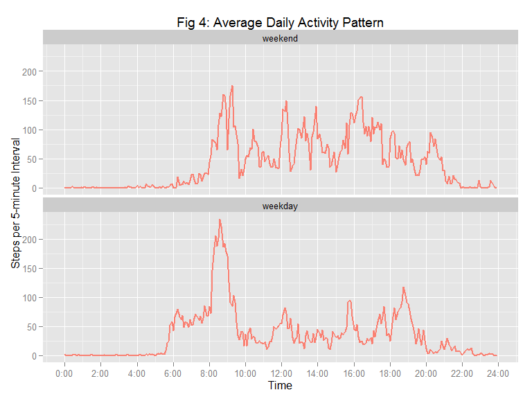

# Reproducible Research: Peer Assessment 1

This assignment makes a brief analysis of data collected from a personal activity monitoring device. This device collects data at 5 minute intervals through out the day. The data consists of two months of data from an anonymous individual collected during the months of October and November, 2012 and include the number of steps taken in 5 minute intervals each day.  

### 1.   Loading and preprocessing the data

The Activity Monitoring Data set was provided in a comma-separated-value (CSV) file within a zip archive.  The variables included in this dataset are:  
  
- steps: Number of steps taking in a 5-minute interval (missing values are coded as NA)  
- date: The date on which the measurement was taken in YYYY-MM-DD format  
- interval: Identifier for the 5-minute interval in which measurement was taken.  
  
- There are 12 observations per hour, 288 observations per day.  
  
The CSV file was extracted from its archive and read into a data frame with its headers.  


```r
act <- read.csv("activity.csv", header = TRUE)
## Preliminary Data Exploration
str(act)
```

```
## 'data.frame':	17568 obs. of  3 variables:
##  $ steps   : int  NA NA NA NA NA NA NA NA NA NA ...
##  $ date    : Factor w/ 61 levels "2012-10-01","2012-10-02",..: 1 1 1 1 1 1 1 1 1 1 ...
##  $ interval: int  0 5 10 15 20 25 30 35 40 45 ...
```

```r
sum(is.na(act)); sum(is.na(act$steps)); mean(is.na(act[, "steps"]))
```

```
## [1] 2304
```

```
## [1] 2304
```

```
## [1] 0.1311475
```
We see from the above that out of 17568 observations in the data set, there are 2304 missing values, all in the "steps" column.  Because their proportion is relativley low (13.11%), we choose to ignore the missing values for now.  
  

```r
act[10:15,]; act[22:27,]
```

```
##    steps       date interval
## 10    NA 2012-10-01       45
## 11    NA 2012-10-01       50
## 12    NA 2012-10-01       55
## 13    NA 2012-10-01      100
## 14    NA 2012-10-01      105
## 15    NA 2012-10-01      110
```

```
##    steps       date interval
## 22    NA 2012-10-01      145
## 23    NA 2012-10-01      150
## 24    NA 2012-10-01      155
## 25    NA 2012-10-01      200
## 26    NA 2012-10-01      205
## 27    NA 2012-10-01      210
```

A peek at the data at the inter-hour boundaries, shown above, indicates a gap in the interval identifier between n55 and (n+1)00, where n is the hour of observation.  
  
### 2.   Mean total number of steps taken per day

The data set is grouped and summed by date in order to plot a histogram of the total number of steps taken each day.  


```r
library(dplyr)
library(ggplot2)

dsteps <- act %>% 
          group_by(date) %>% 
          summarise_each(funs(sum), steps)
table(is.na(dsteps$steps))
```

```
## 
## FALSE  TRUE 
##    53     8
```
We note from the table above, that there are 8 days with missing data.  From earlier, we know that there are 2304 missing values for "steps" in the original data.  Given that there are 288 observations per day, and that 288 x 8 = 2304, this implies that a given date has either all "step" values missing (8 such days) or no missing values at all (53 such days).

To estimate the optimal bin width for the histogram, we use the [Freedman-Diaconis rule](http://en.wikipedia.org/wiki/Freedman-Diaconis_rule): Bin size = 2*IQR/(n^(1/3), where IQR is the interquartile range of the data and n is the number of observations.  Bin width is rounded to the nearest 500.  


```r
(rawBinW <- 500 * round(2 * IQR(dsteps$steps, na.rm = TRUE) / ((dim(dsteps)[1])^(1/3) * 500)))
```

```
## [1] 2500
```

```r
(rawNBins <- ceiling(diff(range(dsteps$steps, na.rm = TRUE))/rawBinW))  ## Number of bins
```

```
## [1] 9
```

This gives a bin size = 2500 and the number of bins = 9.  However, further in this analysis, missing values are imputed and filled in.  A similar calculation done on the data set with missing data filled in with imputed values yields a bin width = 1500, with the number of bins = 15.

We choose an intermediate value of bin width = 2000, with the number of bins = 11, for both histograms, so as to enable a meaningful comparison between raw and imputed data set characteristics.  


```r
binW <- 2000
(nBins <- ceiling(diff(range(dsteps$steps, na.rm = TRUE))/binW))
```

```
## [1] 11
```

```r
## Calculating the Mean and Median number Steps per Day in the Raw Data.
(rawMean <- mean(dsteps$steps, na.rm = TRUE)); (rawMed <- median(dsteps$steps, na.rm = TRUE))
```

```
## [1] 10766.19
```

```
## [1] 10765
```

Fig 1 below is a histogram of the total number of steps taken per day.  


```r
library(grid)
ggplot (dsteps, aes(x = steps)) + 
        geom_histogram(binwidth = binW, fill = "salmon", col = "black") +
        ggtitle("Fig 1: Steps taken per Day (Raw Data)") +
        xlab("Number of Steps per Day") + ylab("Frequency") +
        geom_vline(xintercept = rawMean, col = "red", lwd = 1) +
        annotate("segment" , x = 6000, xend = rawMean, y = 12.5, yend = 12.5,
                 col = "black", arrow = arrow(length = unit(0.1, "inches"))) +
        annotate("text", x = 4000, y = 13.2, 
                 label = paste("Mean Steps per Day = ", round(rawMean)), size = 4)
```

 

The total number of steps taken per day has a Mean = 10766.19 and a Median = 10765.  

From [Live Healthy](http://livehealthy.chron.com/average-walking-stride-length-7494.html) we learn that a man's walking stride length is 2.5 feet (30") and woman's average stride length is 2.2 feet (26.4").  That means it takes just over 2,000 steps to walk one mile, and 10,000 steps is close to 5 miles. A sedentary person
may only average 1,000 to 3,000 steps a day.

This individual is clearly not sedentary, as he (or she) walks an average of around 5 miles per day.  Indeed, there are two days in this period of study where the subject walked 10 miles in a day.  These turn out be the Thanksgiving holidays in the U.S. (the [4th Thursday in November](http://www.timeanddate.com/calendar/monthly.html?year=2012&month=11&country=1) and the following Friday), as shown below.  


```r
paste(dsteps[!is.na(dsteps$steps) & dsteps$steps > 20000, ]$date,
weekdays(as.Date(as.character(dsteps[!is.na(dsteps$steps) & dsteps$steps > 20000, ]$date), 
                                                                    format = "%Y-%m-%d")))
```

```
## [1] "2012-11-22 Thursday" "2012-11-23 Friday"
```
  
### 3.   Average daily activity pattern

We continue our analysis of the data set by making a time series plot of the average number of steps taken per 5-minute interval averaged across all days.  We also determine the 5-minute interval with the highest number of steps, on average across all days.  Since we cannot include NA values in a time series plot or an average calculation, we omit them in this step.  

The data set is grouped by 5-minute interval and averaged in order to plot the time series.  


```r
iSteps <- act[!is.na(act[, "steps"]),] %>% 
          group_by(interval) %>% 
          summarise_each(funs(mean), steps)
```

As noted earlier, the interval identifier shows gaps between n55 and (n+1)00 at the end of every hour. To get a continuous variable for the time series plot, we add a column -- "minutes" -- which is the interval varaible  expressed as minutes from the start of day.  


```r
iSteps <- mutate(iSteps, minutes = (60*floor(interval/100) + (interval %% 100)))
head(iSteps[10:15,])
```

```
## Source: local data frame [6 x 3]
## 
##   interval     steps minutes
## 1       45 1.4716981      45
## 2       50 0.3018868      50
## 3       55 0.1320755      55
## 4      100 0.3207547      60
## 5      105 0.6792453      65
## 6      110 0.1509434      70
```

```r
tail(iSteps)
```

```
## Source: local data frame [6 x 3]
## 
##   interval     steps minutes
## 1     2330 2.6037736    1410
## 2     2335 4.6981132    1415
## 3     2340 3.3018868    1420
## 4     2345 0.6415094    1425
## 5     2350 0.2264151    1430
## 6     2355 1.0754717    1435
```

The following function is used to format the newly introduced minutes variable into HH:MM for the plot in Fig 2.


```r
timeHM <- function(x) {
    h <- floor(x / 60)
    m <- x %% 60
    HMlabel <- sprintf("%d:%02d", h, m)
    return(HMlabel)
}
```

```r
ggplot (iSteps, aes (x = minutes, y = steps)) + geom_line(col = "salmon", size = 1) + 
        scale_x_continuous(name = "Time", breaks = seq(0, 1440, by = 120), labels = timeHM) +
        ggtitle("Fig 2: Average Daily Activity Pattern") + ylab("Steps per 5-minute Interval")
```

 

```r
paste(iSteps[which.max(iSteps$steps), "interval"])      ## the 5-min interval with the max # of steps
```

```
## [1] "835"
```

```r
timeHM(as.integer(iSteps[which.max(iSteps$steps),3]))   ## the HH:MM time of above
```

```
## [1] "8:35"
```

```r
(peak <- round(max(iSteps$steps)))                      ## the number of steps taken in this interval
```

```
## [1] 206
```
The 5-minute interval with the maximum number of steps on average, across all days, is 835, corresponding to 8:35 a.m.  The average rate of motion during this peak interval across all days is 206 steps in 5 minutes.  
  
### 4.   Imputing missing values
  
Before imputing the missing values, we examine whether there is any further pattern to them. e.g.  

1. Are values missing for a particular day of the week?  
2. Are values missing for weekends only?  


```r
weekdays(as.Date(as.character(dsteps$date[which(is.na(dsteps$steps))]), format = "%Y-%m-%d"))
```

```
## [1] "Monday"    "Monday"    "Thursday"  "Sunday"    "Friday"    "Saturday" 
## [7] "Wednesday" "Friday"
```
The above shows that there is no pattern as to which days have missing values -- two are on weekends, six are weekdays.  

Since, the difference between **weekday** and **weekend** activity is of interest to us, we impute missing weekend values from the available **weekend data only**.  Missing weekday values are imputed from the available **weekday** data.  

***If we did not distinguish between weekday and weekend during imputation, it could blur the distinctions between the weekday and weekend activity.***  

So, we first segragate the indices of the Weekends and Weekdays, each of them split into those with NAs and those with filled data.  Then, to help in imputing values, we re-arrange the "steps" variable in an array of values, where each row is the observations in an "interval" and each column is the "date" on which the observation is made. 


```r
library(lubridate)
(naDates <- which(is.na(dsteps$steps)))                     ## indices of dates with NAs (8 total)
```

```
## [1]  1  8 32 35 40 41 45 61
```

```r
(WEinx <- which(wday(as.Date(as.character(dsteps$date), 
                format = "%Y-%m-%d"))  %in% c(1, 7)))       ## indices of all Weekend dates (16 in 2 months)
```

```
##  [1]  6  7 13 14 20 21 27 28 34 35 41 42 48 49 55 56
```

```r
(naWEinx <- intersect(naDates, WEinx))                      ## indices of Weekends with NAs (2 as expected)
```

```
## [1] 35 41
```

```r
(dataWEinx <- WEinx[which(!(WEinx %in% naWEinx))])          ## indices of Weekend dates with data, 16 - 2 = 14
```

```
##  [1]  6  7 13 14 20 21 27 28 34 42 48 49 55 56
```

```r
WDinx <- which(!(1:61 %in% WEinx))                          ## indices of all Weekdays (too long to list)
(naWDinx <- intersect(naDates, WDinx))                      ## indices of Weekdays with NAs (6 as expected)
```

```
## [1]  1  8 32 40 45 61
```

```r
dataWDinx <- WDinx[which(!(WDinx %in% naWDinx))]            ## indices of Weekdays with data (too long)
length(dataWDinx)                                           ## check length, expecting: 61 - 16 - 6 = 39
```

```
## [1] 39
```

```r
library(reshape2)
dcact <- dcast(act, interval ~ date, value.var = "steps")
head(dcact[,1:5])
```

```
##   interval 2012-10-01 2012-10-02 2012-10-03 2012-10-04
## 1        0         NA          0          0         47
## 2        5         NA          0          0          0
## 3       10         NA          0          0          0
## 4       15         NA          0          0          0
## 5       20         NA          0          0          0
## 6       25         NA          0          0          0
```

```r
(dcrows <- dim(dcact)[1]); (dccols <- dim(dcact)[2])
```

```
## [1] 288
```

```
## [1] 62
```
dcact is a 288 x 62 data frame (interval x date) where:  

1. Each row is an observation for a given 5-minute interval  
2. Column 1 is the interval identifier  
3. Columns 2 - 62 represent the dates  
4. The entries in the array are the number of steps taken for that interval-date observation.  
  
The missing values are set equal to the mean of that 5-minute interval across the days with available data, for weekends and weekdays separately.  The mean values are rounded off to an integer value, because we cannot have a non-integral number of steps as an observed value (as distinct from a calculated value).  


```r
## The ...inx vectors were derived from the row indices of dsteps, where each row is a date. In dcact, each
## date is a column, and column 1 is the interval identifier.  So, we use ...inx + 1 in the code below.

for (i in 1:dcrows) {                                                           ## for every 5-min interval
    
    dcact[i, (naWEinx + 1)] <- round(mean(as.integer(dcact[i, (dataWEinx + 1)])))   ## each Weekend NA is set
                                                                                    ## to the mean of WE data.
    
    dcact[i, (naWDinx + 1)] <- round(mean(as.integer(dcact[i, (dataWDinx + 1)])))   ## each Weekday NA is set
}                                                                                   ## to the mean of WD data.
```

We revert to the original form of the data set for further computation.

```r
##  *** Peer Assessor, please note: Now that I have a 288 x 62 data set of interval x date, there are more  
##  elegant ways of proceeding.  I don't really need to melt. But, the instructions specifically asks us to 
##  "Create a new dataset that is equal to the original dataset but with the missing data filled in." ***

newact <- melt(dcact, id.vars = "interval", measure.vars = colnames(dcact)[2:dccols])
colnames(newact)[2:3] <- c("date", "steps") ##  melt() does not revert to the original order and column names.
newact <- newact[c(3,2,1)]                  ##  New data set with missing values filled in
```
The new data set is grouped and summed by date in order to plot a histogram of the total number of steps taken each day.

```r
newdsteps <- newact %>% 
             group_by(date) %>% 
             summarise_each(funs(sum), steps)
(newBinW <-  500 * round(2 * IQR(newdsteps$steps, na.rm = TRUE) / ((dim(newdsteps)[1])^(1/3) * 500)))
```

```
## [1] 1500
```
As explained earlier, although the Freedman-Diaconis rule yields a bin width = 1500, we use a bin width = 2000, as in the earlier histogram, to make a meaningful comparison between raw and imputed data set characteristics.  The new mean and meadian, and the means for weekend and weekday data are calculated below.


```r
(newMean <- mean(newdsteps$steps)); (newMed <- median(newdsteps$steps))
```

```
## [1] 10761.9
```

```
## [1] 10571
```

```r
(MeanWE <- mean(newdsteps$steps[WEinx])); (MeanWD <- mean(newdsteps$steps[WDinx]))
```

```
## [1] 12406.5
```

```
## [1] 10177.16
```
 Fig 3 shows a histogram of the total number of steps taken per day with imputed missing values.
 

```r
ggplot (newdsteps, aes(x = steps)) + 
        geom_histogram(binwidth = binW, fill = "salmon", col = "black") + 
        ggtitle("Fig 3: Steps taken per Day with Imputed Missing Values") +
        xlab("Number of Steps per Day") + ylab("Frequency") +
        geom_vline(xintercept = newMean, col = "red", lwd = 1) +
        geom_vline(xintercept = MeanWD, col = "cornflowerblue", lwd = 1) +
        geom_vline(xintercept = MeanWE, col = "cornflowerblue", lwd = 1) +
        annotate("segment" , x = 6000, xend = newMean, y = 17.5, yend = 17.5,
                 col = "black", arrow = arrow(length = unit(0.1, "inches"))) +
        annotate("text", x = 4000, y = 18.2, 
                 label = paste("Mean Steps / Day (all days) = ", round(newMean)), size = 3) +
        annotate("segment" , x = 6000, xend = MeanWD, y = 12.5, yend = 12.5,
                 col = "black", arrow = arrow(length = unit(0.1, "inches"))) +
        annotate("text", x = 3000, y = 13.2, 
                 label = paste("Mean Steps / Day (Weekdays) = ", round(MeanWD)), size = 3) +
        annotate("segment" , x = 16000, xend = MeanWE, y = 15.0, yend = 15.0,
                 col = "black", arrow = arrow(length = unit(0.1, "inches"))) +
        annotate("text", x = 19000, y = 15.7, 
                 label = paste("Mean Steps / Day (Weekends) = ", round(MeanWE)), size = 3)
```

 
  
The histogram in Fig 3 is identical to that in Fig 1, except for the two bins that contain the mean steps taken on weekdays, bin [10,000, 12,000) and the mean steps taken on weekends, bin [12,000, 14,000).  This is expected, since the imputed values for weekdays and weekends are the means of the remaining weekday and weekend dates respectively, for each 5-minute interval.  

A closer look reveals that the count in bin [10,000, 12,000) has increased by 6, from 16 in Fig 1 to 22 in Fig 3.  This is beacuse their are 6 weekdays in the raw data with NAs.  Likewise, beacuse there are 2 weekend days with NAs in the raw data, the count in bin [12,000, 14,000) has increased from 10 in Fig 1 to 12 in Fig 3.  

In the new data set the total number of steps taken per day has a Mean = 10761.9 and a Median = 10571.  These are lower that those of the raw data set, Mean = 10766.19 and Median = 10765.  This decrease of 4.29 in the Mean (and the lower Median) is because we have 6 weekdays imputed with the value 10177.16 (which is less than the raw data Mean by 589.03)  and only 2 weekend dates imputed with the value 12406.5 (which is greater than the raw data Mean by 1640.31).  

The weighted differences are: 589.03 x 6 = 3534.2 below and 1640.31 x 2 = 3280.62 above the raw data Mean.  Now, 3280.62 - 3534.2 = -253.58.  We divide this by 61 days giving -4.16, the difference between the Mean with the imputed data and the raw data Mean (allowing for rounding errors at several stages in the processing).

Comparing the new summary statistics with the raw, we find a reduced inter-quartile range due to data being filled in close to the mean value, i.e. there more data  points closer to the central point of the distribution.  

```r
tab <- matrix(c(summary(dsteps$steps, digits = 5)[1:6], summary(newdsteps$steps, digits = 5)),
                                                                            nrow = 2, byrow = TRUE)
colnames(tab) <- names(summary(1)); rownames(tab) <- c("Raw Data", "Imputed Data"); tab
```

```
##              Min. 1st Qu. Median  Mean 3rd Qu.  Max.
## Raw Data       41    8841  10765 10766   13294 21194
## Imputed Data   41    9819  10571 10762   12811 21194
```
  
## 5.   Differences in weekday and weekend activity patterns
  
To distinguish between Weekdays and Weekends, we add a factor variable, "day", to the new data set. The data set is then grouped by day (weekend or weekday) and 5-minute interval and the average for each interval is calculated.  This data is used to make time series plots, for weekend and weekday activity, as 2 facets in Fig 4 below.


```r
newact$day <- factor(ifelse((wday(as.Date(as.character(newact$date), format = "%Y-%m-%d"))  %in% 2:6),
                                                                     "weekday", "weekend"))
wisteps <- newact %>% 
           group_by(day, interval) %>% 
           summarise_each(funs(mean), steps)

##  Adding a continuous variable expressed as minutes from start of day, to
##  circumvent the end-of-hour discontinuity in the interval variable. 

wisteps <- mutate(wisteps, minutes = (60*floor(interval/100) + (interval %% 100)))
```


```r
ggplot (wisteps, aes (x = minutes, y = steps)) + geom_line(col = "salmon", size = 1) + 
        scale_x_continuous(name = "Time", breaks = seq(0, 1440, by = 120), labels = timeHM) +                  
        facet_wrap( ~ day, ncol = 1, as.table = FALSE) +
        ggtitle("Fig 4: Average Daily Activity Pattern") + 
        ylab("Steps per 5-minute Interval")
```

 

```r
##  Since peak activity seems to take place before 9:30 am, we look for differences  ##

##  Total # of steps taken between 6 a.m. and 9:30 a.m. per Weekday (average).
(WD6to930 <- with(wisteps, sum(steps[day == "weekday" & (interval > 555 & interval < 930)])))
```

```
## [1] 4274.667
```

```r
##  Total # of steps taken between 6 a.m. and 9:30 a.m. per Weekend day (average).
(WE6to930 <- with(wisteps, sum(steps[day == "weekend" & (interval > 555 & interval < 930)])))
```

```
## [1] 2250.875
```

```r
##  What about working hours?  At work by 9:30 am, leave at 6:00 pm.

##  Total # of steps taken between 9:30 a.m. and 6 p.m. per Weekday (average).
(WDwork <- with(wisteps, sum(steps[day == "weekday" & (interval > 925 & interval < 1800)]))) 
```

```
## [1] 3869.844
```

```r
##  Total # of steps taken between 9:30 a.m. and 6 p.m. per Weekend day (average).
(WEwork <- with(wisteps, sum(steps[day == "weekend" & (interval > 925 & interval < 1800)]))) 
```

```
## [1] 7800.875
```
   
There appear to be differences in activity patterns between weekdays and weekends, based on the time series plots in Fig 4 and the data exploration above. 

#### On Weekdays:

1. The subject jumps out of bed a little before 6:00 am and performs sustained activity till around 9:30 am, peaking between 8:00 and 9:00 am, when the subject takes over 225 steps in some 5-minute intervals.  Over 2 miles are covered before 9:30 am.
2. The bulk of the daytime on weekdays (9:30 am to 6:00 pm) shows **relatively** low activity, with occasional spurts, never reaching 100 steps in a 5-minute interval.  (Relatively, because the subject "walks" a little under 2 miles *at work*.  Also, he or she does not appear to sit down -- compare with weekdays 8:00 pm to midnight.)
3. Then, between 6:00 and 7:00 pm there is a larger spurt of activity, reaching upwards of 100 steps in some 5-minute intervals.
4. Activity on weekdays then tapers off and is virtually undetectable between midnight and around 5:45 am the next morning.
5. The subject covers an average of over 5 miles on the average weekday, over 2 miles before 9:30 am, about 3 miles during the rest of the day.
   
#### On Weekends:

1. The subject crawls out of bed aound 6:00 am and slowly increase his or her activity, peaking between 8:30 amd   9:30 am.  At peak, the number of steps taken, on average, is about 175 in a 5-minute interval.  A little over 1 mile is covered before 9:30 am.
2. There is more activity during the rest of the daytime (9:30 am to 6:00 pm) vis-a-vis weekdays, with an average close to 75 steps per 5-minute interval, with several peaks well over 100 steps per 5-minute interval.  Close to 4 miles are covered in this period.
3. There is another spurt of activity between 8:00 and 9:00 pm on weekend nights.
4. Thereafter activity tapers off and is imperceptible between midnight and 6:00 am the next morning.
5. The subject covers an average of over 6 miles per day on the average weekend, a little over 1 mile before 9:30 am, 5 miles during the rest of the day.
  
As noted earlier, the subject does over 10 miles on each of the Thanksgiving holidays - the only instances when more than 18,000 steps (9 miles) have been taken in a day.  If these days were considered weekend days rather than weekdays, the difference between weekday and weekend activity would have been more stark.  

This is a physically active person.  Does he or she walk to work?  What work does he do?  Does she get a ride back part of the way in the evenings?  Does he  do a lot of yard work on weekends?  Does she go out for dinner (and dancing) on weekends?  Very interesting!  
  
  

---------------------------------------------------------------------------------------------------  
  
